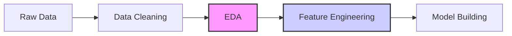

# Exploratory Data Analysis (EDA) & Feature Engineering

This document provides a comprehensive guide to Exploratory Data Analysis (EDA) and Feature Engineering, essential steps in any Machine Learning pipeline.

---

## 1. Exploratory Data Analysis (EDA)

EDA is the process of analyzing datasets to summarize their main characteristics, often using visual methods.

### Key Steps in EDA

1.  **Data Profiling**: Understanding the shape, types, and summary statistics (`df.describe()`, `df.info()`).
2.  **Missing Value Analysis**: Identifying and visualizing missing data.
3.  **Outlier Detection**: Using Box plots, Z-score, or IQR to find anomalies.
4.  **Univariate Analysis**: Analyzing single variables (Histograms, KDE plots, Count plots).
5.  **Bivariate/Multivariate Analysis**: Understanding relationships between variables (Scatter plots, Heatmaps, Pair plots).
6.  **Correlation Analysis**: Measuring the strength of relationships using Pearson or Spearman correlation.

---

## 2. Feature Engineering

Feature engineering is the process of using domain knowledge to extract features from raw data that make machine learning algorithms work better.

### A. Feature Transformation

- **Handling Missing Values**: Mean/Median/Mode imputation, Random Sample imputation, or creating a new category.
- **Handling Categorical Features**:
  - **One-Hot Encoding**: For nominal data (no order).
  - **Label/Ordinal Encoding**: For ordinal data (has order).
  - **Target Guided Ordinal Encoding**: Based on the target variable.
- **Handling Outliers**: Trimming, Capping (Winsorization), or transformation (Log, Square root).
- **Feature Scaling**:
  - **Standardization (Z-score)**: Centers mean at 0 and variance at 1.
  - **Normalization (Min-Max)**: Scales values between 0 and 1.

### B. Feature Selection

- **Filter Methods**: Correlation, Chi-Square, Information Gain.
- **Wrapper Methods**: Forward selection, Backward elimination, Recursive Feature Elimination (RFE).
- **Embedded Methods**: LASSO (L1 Regularization), Tree-based (Feature Importance).

### C. Feature Construction

- Creating new features from existing ones (e.g., extracting "Date" and "Month" from a "Timestamp").

---

## 3. Interview Focused Q&A

### EDA

1.  **Q: How do you handle missing data in a dataset?**
    _A: Depending on the mechanism (MCAR, MAR, MNAR), I can use imputation (Mean/Median/Mode), predictive modeling, or deletion if the percentage is very low._
2.  **Q: What is the difference between a Histogram and a Bar chart?**
    _A: Histograms are used for continuous data to show frequency distributions, while Bar charts are used for categorical data._

### Feature Engineering

1.  **Q: Why do we need feature scaling?**
    _A: Scaling ensures that features with larger magnitudes do not dominate the model (especially for distance-based algorithms like KNN, SVM, and gradient descent-based models)._
2.  **Q: When should you use One-Hot Encoding vs. Label Encoding?**
    _A: Use One-Hot for nominal data (e.g., Color: Red, Blue) where order doesn't matter. Use Label Encoding for ordinal data (e.g., Education: High School, PhD) where order exists._

---

