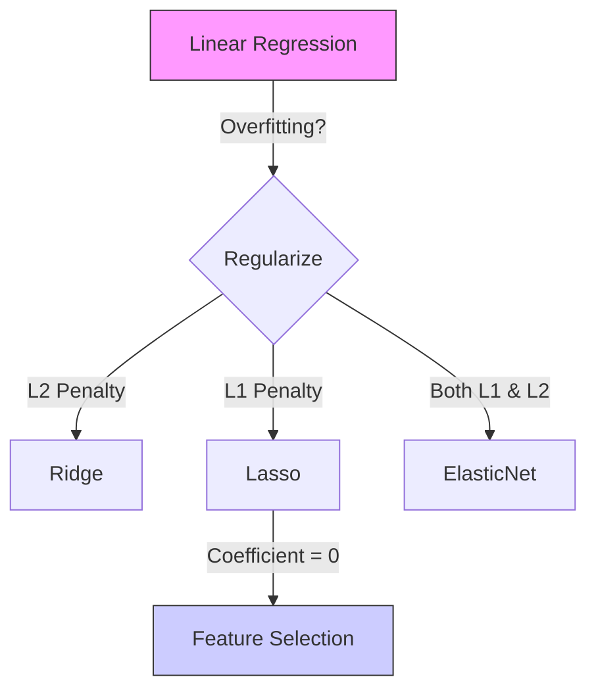

# Linear Regression & Regularization (Ridge, Lasso, ElasticNet)

Linear Regression is a fundamental supervised learning algorithm used to predict a continuous target variable based on one or more independent variables.

---

## 1. Simple & Multiple Linear Regression

### The Equation

- **Simple Linear Regression**: $y = \beta_0 + \beta_1x + \epsilon$
- **Multiple Linear Regression**: $y = \beta_0 + \beta_1x_1 + \beta_2x_2 + ... + \beta_nx_n + \epsilon$
  _Where $\beta_0$ is the intercept, $\beta_i$ are coefficients, and $\epsilon$ is the error term._

### Cost Function (Mean Squared Error)

The goal is to minimize the sum of squared residuals:
$$MSE = \frac{1}{n} \sum_{i=1}^{n} (y_i - \hat{y}_i)^2$$

### Assumptions

1.  **Linearity**: Relationship between $X$ and $y$ is linear.
2.  **No Multicollinearity**: Independent variables should not be highly correlated.
3.  **Homoscedasticity**: Constant variance of error terms.
4.  **Normality**: Residuals should be normally distributed.

---

## 2. Regularization Techniques

Regularization is used to prevent **Overfitting** by adding a penalty term to the cost function.

### A. Ridge Regression (L2 Regularization)

Adds a penalty equal to the **square of the magnitude** of coefficients.
$$Cost = MSE + \lambda \sum_{j=1}^{p} \beta_j^2$$

- **Impact**: Shrinks coefficients towards zero, but never exactly zero.
- **Use Case**: When you have many features with small/medium effects.

### B. Lasso Regression (L1 Regularization)

Adds a penalty equal to the **absolute value of the magnitude** of coefficients.
$$Cost = MSE + \lambda \sum_{j=1}^{p} |\beta_j|$$

- **Impact**: Can shrink coefficients **exactly to zero**, performing automated **Feature Selection**.
- **Use Case**: When you want a sparse model or believe only a few features are important.

### C. ElasticNet Regression

A hybrid approach that combines both L1 and L2 penalties.
$$Cost = MSE + \lambda_1 \sum |\beta_j| + \lambda_2 \sum \beta_j^2$$

- **Use Case**: Useful when there are correlated features; Lasso might pick one at random, while ElasticNet tends to keep or remove them together.

---

## 3. Comparison Table

| Feature               | Linear Regression | Ridge (L2)        | Lasso (L1)          | ElasticNet  |
| :-------------------- | :---------------- | :---------------- | :------------------ | :---------- |
| **Penalty**           | None              | $\lambda \beta^2$ | $\lambda \|\beta\|$ | Both        |
| **Feature Selection** | No                | No                | Yes                 | Yes         |
| **Overfitting**       | High              | Low               | Low                 | Low         |
| **Multicollinearity** | Sensitive         | Robust            | Robust              | Most Robust |

---

## 4. Interview Focused Q&A

1.  **Q: What happens if $\lambda$ is too high in Ridge/Lasso?**
    _A: The model becomes too simple (high bias), leading to underfitting._
2.  **Q: Why do we need to scale features before regularization?**
    _A: Penalties are applied to coefficients. Features with larger scales will have smaller coefficients naturally, making the penalty unfair. Scaling ensures all features are treated equally._
3.  **Q: What is the main disadvantage of Lasso?**
    _A: If features are highly correlated, Lasso arbitrarily selects one and sets others to zero, which might lose information. ElasticNet solves this._

---

