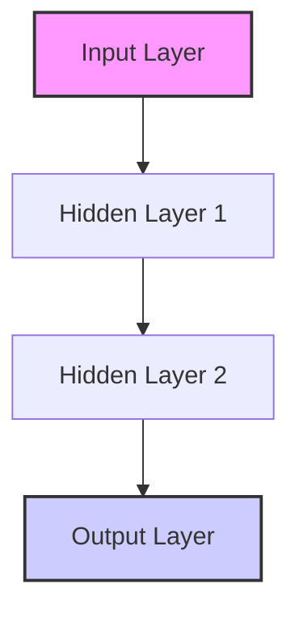

# Deep Learning Interview Notes: ANN, RNN, CNN

This document provides a structured overview of Artificial Neural Networks (ANN), Recurrent Neural Networks (RNN), and Convolutional Neural Networks (CNN) with a focus on interview preparation.

---

## 1. Artificial Neural Networks (ANN) & Feedforward Neural Networks (FNN)

Artificial Neural Networks are the backbone of deep learning, inspired by the structure of the human brain.

### Key Concepts

- **Perceptron**: The simplest form of a neural network, consisting of a single layer with weights, bias, and an activation function.
- **Multilayer Perceptron (MLP)**: A feedforward neural network with one or more hidden layers between the input and output layers.
- **Activation Functions**:
  - **Sigmoid**: Outputs between 0 and 1. Used in binary classification.
  - **ReLU (Rectified Linear Unit)**: $f(x) = \max(0, x)$. Solves vanishing gradient problem.
  - **Tanh**: Outputs between -1 and 1. Zero-centered.
  - **Softmax**: Used in the output layer for multi-class classification to provide probabilities.

### Weight Initialization

- **Xavier/Glorot Initialization**: Good for Sigmoid/Tanh activations.
- **He Initialization**: Best for ReLU and its variants.

---

## 2. Recurrent Neural Networks (RNN)

RNNs are designed for sequential data (time-series, text, audio) where the output at a certain time step depends on previous inputs.

### Forward Propagation in RNN

For a single time step $t$:

1. **Hidden State Update**:
   $$h_t = \sigma(W_{hh}h_{t-1} + W_{xh}x_t + b_h)$$
   _Where $h_t$ is the current hidden state, $h_{t-1}$ is the previous hidden state, $x_t$ is the current input._
2. **Output Calculation**:
   $$y_t = \sigma(W_{hy}h_t + b_y)$$

### Vanishing & Exploding Gradients

- **Vanishing Gradient**: Gradients become very small during backpropagation through time (BPTT), making long-term dependency learning difficult.
- **Exploding Gradient**: Gradients become very large, leading to unstable weight updates.

---

## 3. Convolutional Neural Networks (CNN)

CNNs are primarily used for image processing and computer vision tasks.

### Core Operations

- **Convolution**: Applying filters (kernels) to the input image to extract features like edges, textures, etc.
- **Padding**: Adding zeros around the borders to maintain spatial dimensions.
- **Stride**: The number of pixels the filter moves across the image.
- **Pooling Layers**:
  - **Max Pooling**: Retains the maximum value in a window (reduces spatial size while keeping important features).
  - **Average Pooling**: Computes the average value in a window.
- **Flattening**: Converting the 2D feature map into a 1D vector to pass it into a Fully Connected (Dense) layer.

---

## 4. Interview Focused Q&A

### ANN/FNN

1. **Q: What is the difference between a Perceptron and an MLP?**
   _A: A perceptron is a single-layer neural network, while an MLP has one or more hidden layers and can solve non-linearly separable problems._
2. **Q: Why is ReLU preferred over Sigmoid in hidden layers?**
   _A: ReLU avoids the vanishing gradient problem in positive regions and is computationally efficient._

### RNN

1. **Q: How does an RNN handle sequences of varying lengths?**
   _A: Through padding or by processing sequences one time step at a time until the end of the sequence._
2. **Q: How do GRU and LSTM solve the vanishing gradient problem?**
   _A: They use "gates" (forget, input, output gates) to regulate the flow of information and maintain long-term memory._

### CNN

1. **Q: What is the purpose of a 1x1 convolution?**
   _A: It is used for dimensionality reduction (reducing channels) and adding non-linearity._
2. **Q: What is the difference between Valid and Same padding?**
   _A: Valid padding means no padding (output size shrinks), whereas Same padding adds zeros to ensure output size equals input size._

---

